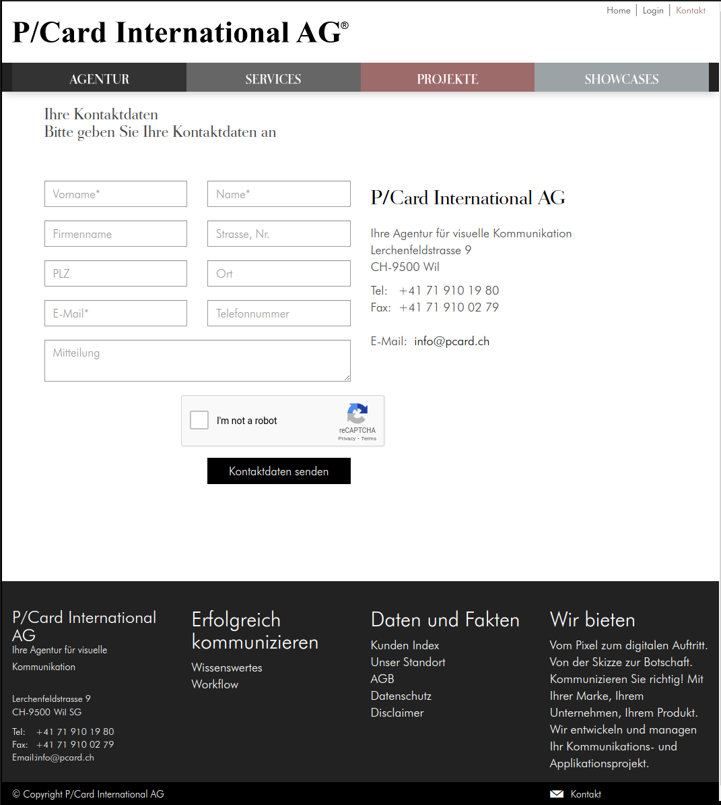

# pcard

Target: create an HTML file with a form similar to a chosen website. Due to 
plagiarism rights, I have chosen https://www.pcard.ch/kontakt.

This is a screenshot of the page:  

I searched for a similar freely available font, and found https://fonts.google.com/specimen/Roboto.  

[task description](assets/Technical-Assessment.pdf)